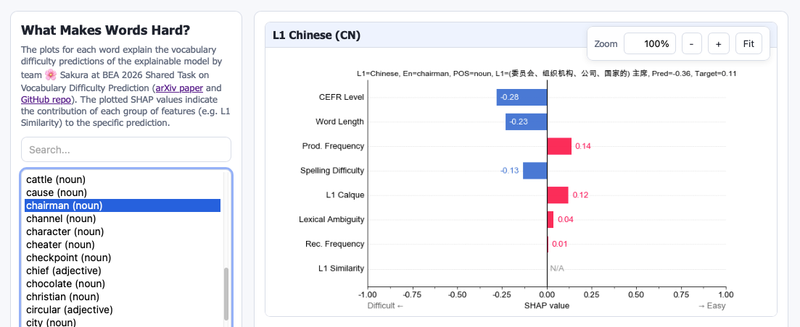

# What Makes Words Hard? 🌸 Sakura at BEA 2026 Shared Task on Vocabulary Difficulty Prediction

This repository contains **source code** of submissions of the Sakura team to the BEA 2026 Shared Task on Vocabulary Difficulty Prediction, in particular, the winning submission in the open track, and our explainable system that performed competitively in the closed track. It also contains **all predictions**, including interim predictions made by each prompt or finetuned LLM.

👀 [Explore SHAP-based explanations](https://ynklab.github.io/vocabulary-difficulty/) from our `explainable` system.

<p align="center"><a href="https://ynklab.github.io/vocabulary-difficulty/"></a></p>

📖 [Read our paper on arXiv](https://arxiv.org/abs/2605.14257).

📚 Learn more about the [BEA 2026 Shared Task on Vocabulary Difficulty Prediction](https://www.britishcouncil.org/data-science-and-insights/bea2026st) and check out its [Github repo](https://github.com/britishcouncil/bea2026st/).

🥇 [Full shared task results](https://github.com/britishcouncil/bea2026st/blob/main/results/results_summary_test.md).

## Installation and Setup

1. **Clone the repository** to your local machine:

```bash
git clone git@github.com:ynklab/vocabulary-difficulty
cd vocabulary-difficulty
```

2. **Create and activate the Conda environment** using the provided `environment.yml` file:

```bash
conda env create -f environment.yml
conda activate bea2026st
```

3. Based on which models you want to run, get the necessary (#data-files).


4. Next steps: To match models and results presented in our paper/submitted to the shared task against the codebase look at the following shell scripts:

  - `scripts/make_submission.sh`: Run the ensembles/feature-based models submitted to the shared task.
  - `scripts/results_tables.sh`: Create result tables (CSV and LaTeX) found in the paper.
  - `scripts/make_shap.sh`: Create SHAP explanations and plots ([browsable online](https://ynklab.github.io/vocabulary-difficulty/)).
  
  From the first two files you can backtrack to individual features or models combined in the ensembles and their implementations. Scripts for fine-tuning open-weight models can be found in `jobs`. We also ran setups not included in the paper and some of the result/prediction files were renamed. If uncertain about hyperparameters or exact models, refer to the paper's appendices.


## Data Files

We use frequencies from the [Lang-8 learner corpus](https://sites.google.com/site/naistlang8corpora/), but we cannot redistribute the frequency files:

- `data/lang-8-en-es.tsv`: English word frequencies for L1 Spanish.
- `data/lang-8-en-any.tsv`: English word frequencies for all L1s.
- `data/lang-8-en-cn.tsv`: English word frequencies for all Chinese.

If you need assistance recreating the frequency files from the corpus, contact us!

We also use the [EVP](https://englishprofile.org/?menu=evp-online) CEFR levels:

- `data/evp_pos_combined_levels.csv`

We use the lowest level for each word in EVP, e.g. for “table”, we use A1 although EVP has both A1 and B1 based on sense.

Some of our models also use these:

- `gse_levels.csv`: [GSE](https://www.english.com/gse/teacher-toolkit/user/vocabulary) is another source of CEFR levels.
- `en-glasgow.csv`: [The Glasgow norms](https://link.springer.com/article/10.3758/s13428-018-1099-3#Sec13), available online as a supplementary CSV file “ESM 2”.

All the other data (e.g. [TUBELEX](https://github.com/naist-nlp/tubelex) frequencies) will be downloaded automatically as you run the scripts.

Note that each data file may have a different license. See [`data/LICENSE`](data/LICENSE) for the license covering the shared task data itself, which is also included in this repository.

## General Technical Information

The following partially describes how our implementation works in general. It may not always reflect the particular runs submitted to the shared task, discussed in the paper. For those, please refer to the [Installation and Setup](#installation-and-setup) above and our paper.

### Running the feature-based models

Here we just explain explains basic use for experiments. See [Cross-Validation and Ensembling](#cross-validation-and-ensembling) below for how to use the same script crss-validate and train our pipeline. Note that `scripts/run_features.py` has detailed helped and has a set of default features, e.g. EVP CEFR levels, TUBELEX and BNC-Spoken frequencies, word length, L1-English word similarity (based on Levenshtein distance), which are used even with no options are given. Options can be used to disable/enable features and change other aspects of modeling. Some of the features are based on LLM prompting, e.g. [trickiness](#trickiness), some on fine-tuned LLM predictions, and even the original baselines (open/closed) can be added as a feature. See `--help` for options.

Run linear regression with the default features:

```bash
python scripts/run_features.py
```
**Expected output (will be slightly different based on current default features):**

```
Features:           ['evp_level', 'tube_log_frequency', 'bnc_log_frequency', 'L1_similarity', 'word_length']
Frequency features: ['tube_log_frequency', 'bnc_log_frequency']
Model:              <class 'sklearn.linear_model._base.LinearRegression'>
Trained on:         train, n=6091
Evaluated on:       dev, n=677

PCC of model predictions
========================
cn: features: 0.696 frequency: 0.582 / baselines: open: 0.804 closed: 0.736
de: features: 0.664 frequency: 0.392 / baselines: open: 0.800 closed: 0.753
es: features: 0.665 frequency: 0.430 / baselines: open: 0.787 closed: 0.748

Error correlation/same-signedness vs. open baseline
===================================================
cn: feat: PCC = 0.71, 70% same sign (82% of above-average errors)
    freq: PCC = 0.66, 69% same sign (79% of above-average errors)
de: feat: PCC = 0.61, 64% same sign (72% of above-average errors)
    freq: PCC = 0.53, 64% same sign (69% of above-average errors)
es: feat: PCC = 0.59, 67% same sign (73% of above-average errors)
    freq: PCC = 0.50, 62% same sign (68% of above-average errors)

Data statistics
===============
cn: μ = 1.69, σ = 1.69, 51% data within ±σ, all within ±4.12σ, ⬇ -5.27 ⬆ 4.04
de: μ = 1.83, σ = 1.83, 49% data within ±σ, all within ±4.03σ, ⬇ -5.54 ⬆ 4.06
es: μ = 1.92, σ = 1.92, 50% data within ±σ, all within ±3.59σ, ⬇ -4.96 ⬆ 4.54
Writing results to results/features_errors.csv.
Writing plot to results/features_errors_plot.pdf.
```

### LLM Fine-Tuning

See [README-finetuning.md](README-finetuning.md) for finetuning implementation. Most of the LLM fine-tuning code is written using OpenAI Codex.

You can use the CV results of the already finetuned model as a feature, e.g.:

```bash
python scripts/run_features.py --cv --finetuned
```

### Trickiness

Trickiness is an example of a prompt-based feature. Other prompt-based features are implemented similarly.

Some items get a more difficult rating because the question itself is tricky. We approximate trickiness by prompting an LLM to "solve" each test item via OpenAI API:

```bash
python scripts/run_prompting.py --model OPENAI_MODEL_NAME --prompt PROMPT_NAME
```

For a final run predicted on `test`, use:

```bash
python scripts/run_prompting.py --final-data --model OPENAI_MODEL_NAME --prompt PROMPT_NAME
```

In this script, `whole` always means `train+dev` only (never `test`).

To run in batch mode (cheaper), do this instead:

```bash
python scripts/run_prompting.py --batch --model OPENAI_MODEL_NAME --prompt PROMPT_NAME
# You can submit multiple batches like this. The script will remember the batch ID for
# each model-prompt combination.
# Wait until finished and process the data (or try to see if finished):
python scripts/run_prompting.py --from-batch --model OPENAI_MODEL_NAME --prompt PROMPT_NAME
```

The repo already contains predictions from several models and prompts, so you do not need to rerun it.

You can use `scripts/run_prompting.py` as a basis for your own prompting approach.

### Calque and Lexical ambiguity

Here, calque refers to an English item that corresponds to a component-by-component (morpheme-level) translation of an L1 word.
Lexical ambiguity refers to polysemy or homonymy, where the intended meaning may be difficult for L2 learners to determine.
See the prompts in run_prompting.py for more details.

Both are now part of the default features, e.g.

```bash
python scripts/run_features.py 						# includes calque, lexical ambiguguity and trickiness
python scripts/run_features.py --no-calque 			# includes lexical ambiguguity and trickiness but not calque
python scripts/run_features.py --no-prompting 		# includes no prompting-based features at all
```

Note: also tried transliteration (available as `--transliteration`), but little help.

### Difficulty

We also simply zero-shot prompt for difficulty using G-Eval style probability weighting. Current GPT-5.2 results can be added as features using `--difficulty`. Alone, it has PCC of 0.6 to 0.7, but it can be useful as an additional feature. 

### Cross-Validation and Ensembling

By default, our scripts use the task's original train/dev (9:1) split. A single split works well to quickly test something, but for the final models we use cross-validation and re-training on the whole (original train+dev) data.

Note: The 5 folds mentioned below are now also used for finetuning, but the encoder baselines were trained on the old split, so we should never used baselines (`-B open` or `-B closed`) with CV unless we rerun their training process on the CV splits.

#### Scheme and How to Run It

Using `n` models `M_i` (e.g. one feature-based and one fine-tuned LLM) and `k` folds (T_j, D_j), we will:

1. Train each model `M_i` on each fold's training data `T_j` using cross-validation.

2. Predict each fold's dev data `M_i(D_j)`. All folds taken together give us out-of-fold (OOF) predictions for each model.

   	Steps 1 and 2 example example command for LLM fine-tuning:
   
   	`python scripts/finetune_llm.py --config-name {CONFIG} --model-name {HF_MODEL_NAME} --calibrate --all-in-one {HYPERPARAMETERS} {CV_FOLD_OPTIONS}`
   
   	To run training on several folds in parallel, use `scripts/run_finetune_llm_cv_parallel.sh`.

3. Choose a subset `M*` of the models based on the OOF predictions. This includes hyper-parameter selection, e.g. we may choose one fine-tuned LLM with the best hyperparameters and one feature-based model with the best hyperparameters, two fine-tuned encoders differing in the base model, etc.

	Example of cross-validating (using OOF predictions) an ensemble of multiple finetuned LLMs:

   	`python scripts/run_features.py --no-default-features --finetuned --finetuned-configs {CONFIG1}--{HF_MODEL_NAME1} ... --cv`

4. Use the out-of-fold predictions of each model to train a simple stacked ensemble `E` (regularized linear regression where each model's output is a feature). Note that this step is cheap, and evaluation of `E` using the OOF predictions gives a good estimate of how good our model is.

   Training the final ensemble of the same models (`--model ridge` is regularized linear regression):

   `python scripts/run_features.py --no-default-features --finetuned --finetuned-configs {CONFIG1}--{HF_MODEL_NAME1} ... --model ridge --final-train ENSEMBLE_NAME`
   

5. Re-train each model of `M*` on the complete data. The stacked ensemble (from step 4) of the retrained models will be our final model.

 	Example of fine-tuning on the whole train+dev data and predicting on test data:

   	`python scripts/finetune_llm.py --config-name {CONFIG_FINAL} --model-name {HF_MODEL_NAME} --calibrate --all-in-one {HYPERPARAMETERS} --final-data`
   	
   	Example of LLM prompting on test data :
   	
   	`python scripts/run_prompting.py --model {OPENAI_MODEL_NAME} --prompt {PROMPT_NAME} --<batch|from-batch>  --final-data`
   
	Final ensemble predictions (`--track open` and ENSEMBLE_NAME selects output subdirectories in `submission`):

    `python scripts/run_features.py --no-default-features --finetuned --finetuned-configs {CONFIG_FINAL1}--{HF_MODEL_NAME1} ... --final-predict ENSEMBLE_NAME --track open`

We will likely repeat this, selecting different subsets `M*` in step 3 to create several well-performing models (up to 3 submissions per track).


#### The Splits

To keep costs reasonable (for LLM fine-tuning), we will use 5-fold cross-validation. We can, of course, first fine-tune a model on one or two folds, to see if it behaves reasonably.

The splits to use are in `data/cv-split-ids-5.json`. Unless you have a good reason to do so, use these, and do not create new ones.

For `scripts/finetune_llm.py`: `--cv-mode whole` means "run all CV folds". To train once on all train+dev data and predict on test, use `--final-data`. Predictions for this mode are written under `predictions/finetuned_llm/test/`.

To using the CV splits with `run_features.py`, simply use `--cv`, e.g.

```bash
python scripts/run_features.py --cv
```

Mean results for the feature and frequency baselines will be shown. To display standard deviations, use `--sd!`, e.g.:

```bash
python scripts/run_features.py --cv --sd
```

Output:
```
cn: features: 0.784±0.007 frequency: 0.693±0.003 / baselines: open: 0.804 closed: 0.736
de: features: 0.756±0.010 frequency: 0.515±0.011 / baselines: open: 0.800 closed: 0.753
es: features: 0.770±0.008 frequency: 0.529±0.018 / baselines: open: 0.787 closed: 0.748
```

Script for creating CV splits:

```bash
python scripts/make_splits.py -k5 -o data/cv-split-ids-5.json
python scripts/make_splits.py -k10 -o data/cv-split-ids-10.json
```

